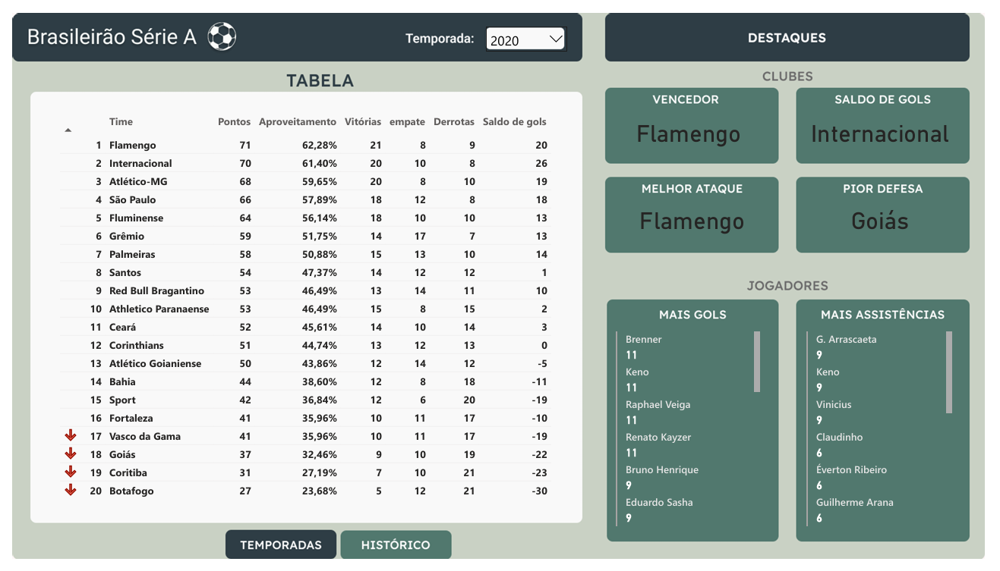
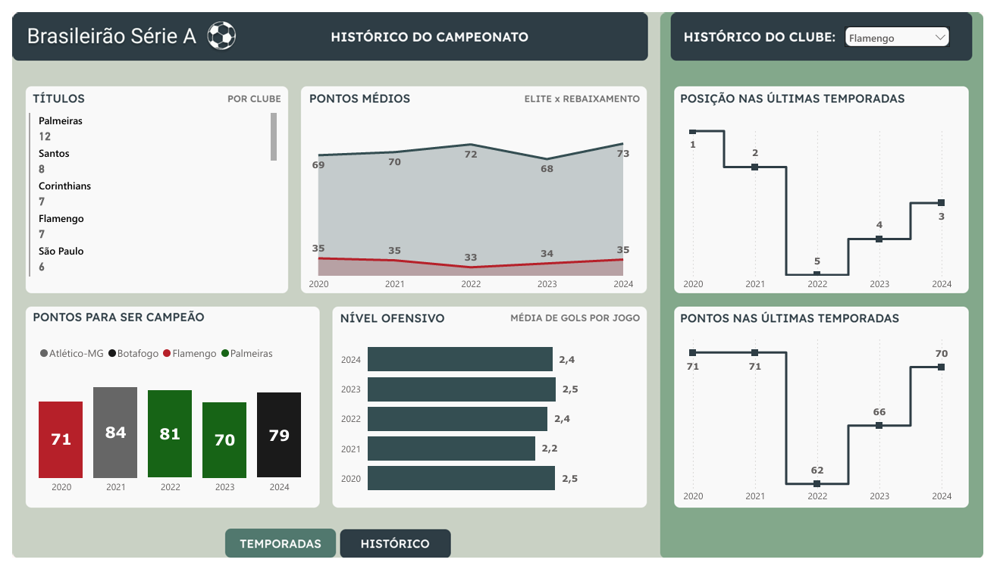

# Dashboard Brasileirão Série A (2020–2024)

Este projeto apresenta um dashboard interativo desenvolvido no Power BI, com dados do Campeonato Brasileiro Série A entre 2020 e 2024. O objetivo foi aplicar meus conhecimentos em DAX, modelagem de dados e design de visualizações.

---

## Estrutura do Dashboard

### Página 1 — Análise por Temporada

- Classificação completa da temporada selecionada
- Destaques dos clubes (melhor ataque, pior defesa, campeão, melhor saldo de gols)
- Destaques dos jogadores (artilheiro, líder de assistências, participação em gols)

### Página 2 — Panorama Geral (2020–2024)

- Ranking de títulos por clube
- Comparativo de pontuação: elite vs rebaixamento
- Evolução da colocação e pontuação dos times
- Média de gols por jogo por temporada

---

## Tecnologias

- Power BI (visualizações e interatividade)
- DAX (medidas e cálculos)
- Web scraping com Selenium (dados coletados da ESPN)
- Figma (design das telas de fundo)

---

## Alguns Insights

- Palmeiras lidera o ranking com 12 títulos
- Atlético-MG fez a maior pontuação do período analisado (84 pontos)
- A pontuação média da elite é de aproximadamente 70 pts e dos rebaixados 35 pts
- Flamengo e Palmeiras se destacam pela ótima consistência nas temporadas analisadas. Ficando no topo por todo o período analisado.
- A media de gols por jogo das temporadas analisadas variou pouco. O nível de ofensividade é bem regular em todas as temporadas.

---

## Como Usar

- Use os filtros para explorar clubes e temporadas
- Navegue entre as páginas usando os botões inferiores
- Passe o mouse nos gráficos para ver detalhes

---

## Nota

Os dados foram extraídos da ESPN e o projeto foi feito como exercício prático de aprendizado em Power BI.
